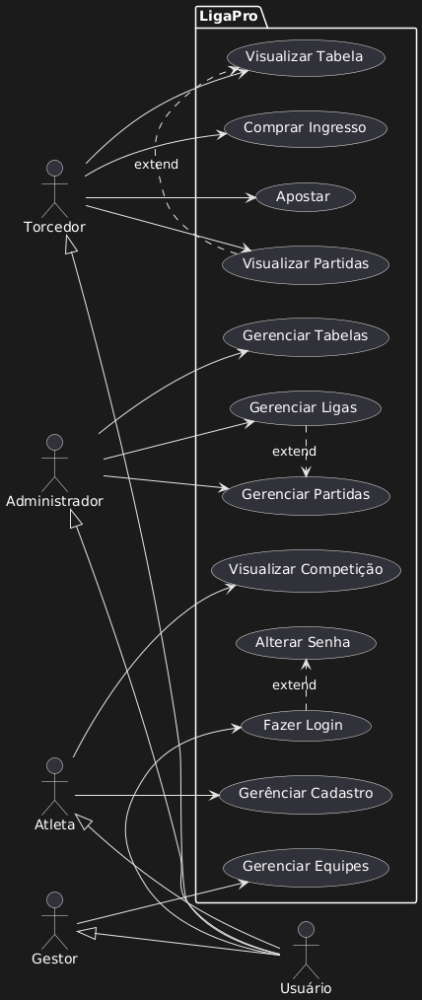
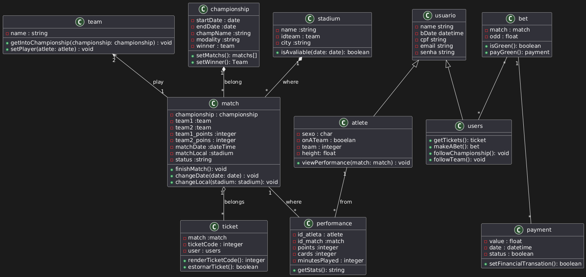
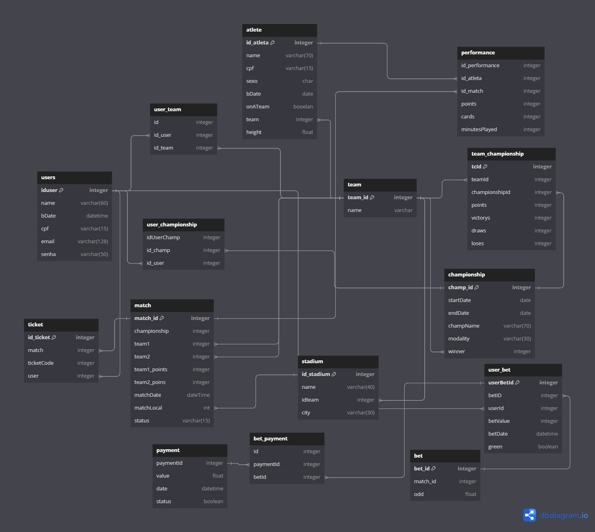

# Gerenciador de Competições

## Descrição do Projeto
Este projeto é um sistema de gerenciamento de competições esportivas, desenvolvido para centralizar e organizar todas as informações relevantes de ligas, equipes e atletas. O sistema permite que diferentes usuários desempenhem funções específicas, como o gerenciamento de ligas, cadastro de equipes, e acompanhamento de resultados.

## Objetivo
O objetivo do sistema é automatizar e simplificar o gerenciamento de competições, proporcionando uma experiência organizada e eficiente para todos os envolvidos, desde os administradores das ligas até os torcedores.

## Atores do Sistema e Responsabilidades

### 1. Administrador de Liga
- Responsável pela criação, edição e exclusão de ligas.
- Gerencia partidas e mantém as tabelas de pontuação atualizadas.
- Visualiza o desempenho das equipes e das competições para garantir que todos os dados estejam organizados.

### 2. Gestor de Equipes
- Realiza o cadastro de novas equipes e associa atletas a essas equipes.
- Garante que as informações essenciais, como estádio e recursos adicionais, estejam cadastradas no sistema.
- Atua na manutenção dos dados das equipes, para que as competições ocorram de forma organizada e precisa.

### 3. Atleta
- Cadastra e atualiza informações pessoais, incluindo dados essenciais como altura, data de nascimento, sexo, e identificador pessoal.
- Permite a associação do atleta a uma equipe, para que ele possa participar das competições.

### 4. Torcedor
- Visualiza as tabelas de pontuação e resultados das partidas.
- Pode comprar ingressos para jogos futuros e acompanhar o desempenho de suas equipes favoritas.

## Visão Geral das Funcionalidades
- **Gerenciamento de Ligas**: Inclui o controle total sobre criação, edição e organização das competições.
- **Cadastro e Associação de Equipes e Atletas**: Permite que os gestores de equipes registrem todos os dados essenciais para participação nos campeonatos.
- **Interação com Torcedores**: Torcedores podem visualizar tabelas e resultados e garantir presença nas partidas.

## Contexto
O sistema visa atender às necessidades de organização e acompanhamento de competições esportivas, oferecendo uma plataforma unificada que permite um gerenciamento eficiente e uma experiência completa para todos os envolvidos. O foco está em proporcionar clareza e facilidade de uso em cada etapa, desde o gerenciamento da competição até o acompanhamento por parte dos torcedores.

## Histórias de Usuário

### 1. Administrador de Liga
- **História 1**: Como **administrador de liga**, eu quero poder criar, editar e excluir ligas no sistema para gerenciar de forma eficaz todas as competições disponíveis.
- **História 2**: Como **administrador de liga**, eu quero ser capaz de organizar as partidas da liga, incluindo a definição de datas, horários e locais para que o cronograma das competições seja claro e acessível.
- **História 3**: Como **administrador de liga**, eu quero visualizar e gerenciar as tabelas de pontuação das ligas para acompanhar o desempenho das equipes e atualizá-las conforme necessário.

### 2. Gestor de Equipes
- **História 1**: Como **gestor de equipes**, eu quero cadastrar novas equipes no sistema para que elas possam participar das competições.
- **História 2**: Como **gestor de equipes**, eu quero associar atletas à minha equipe para que possam participar oficialmente das competições.
- **História 3**: Como **gestor de equipes**, eu quero cadastrar informações detalhadas sobre a equipe, como estádio e insumos, para garantir que todos os dados necessários estejam disponíveis no sistema.
- **História 4**: Como **gestor de equipes**, eu quero visualizar e editar os dados das equipes já cadastradas para que as informações estejam sempre atualizadas e corretas.

### 3. Atleta
- **História 1**: Como **atleta**, eu quero poder cadastrar e atualizar meus dados pessoais (nome, identificador, altura, data de nascimento, sexo) para que meu perfil esteja completo e correto no sistema.
- **História 2**: Como **atleta**, eu quero visualizar as competições e partidas em que estou registrado para acompanhar minha programação e desempenho.

### 4. Torcedor
- **História 1**: Como **torcedor**, eu quero visualizar as tabelas de pontuação das ligas para acompanhar o desempenho das equipes.
- **História 2**: Como **torcedor**, eu quero ver os placares das partidas já concluídas para acompanhar os resultados das competições.
- **História 3**: Como **torcedor**, eu quero ter a possibilidade de comprar ingressos para partidas futuras para que eu possa assistir aos jogos presencialmente.
- **História 4**: Como torcedor, gostaria de poder realizar apostas na plataforma, para assim que eu possa ter a chance de ganhar dinheiro.

## Digrama de casos de uso

## Diagrama de Sequencia
Diagrama implementando os casos de uso de compra de ingresso, associação de jogador a equipe, e aposta na plataforma

## Diagrama de Classes

## Diagrama de Comunicação

## Diagrama Lógico

